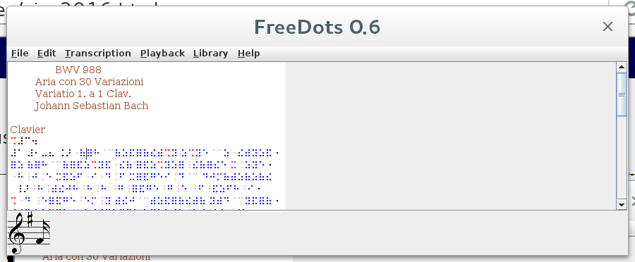
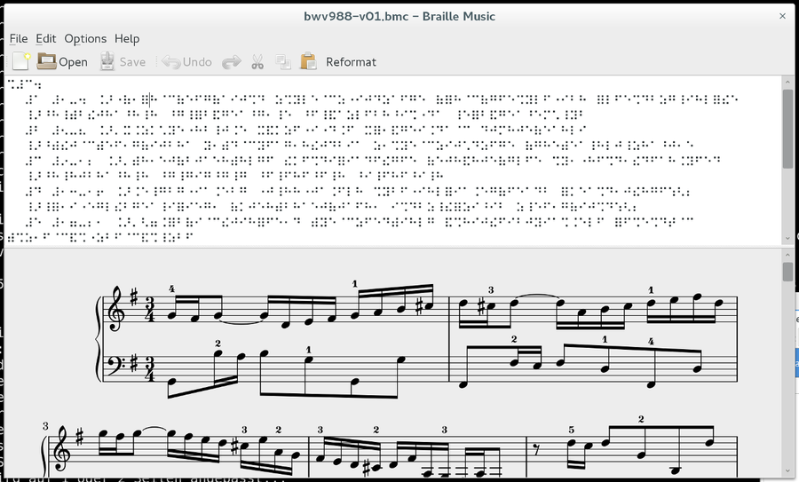

.. include:: <s5defs.txt>

======================
Braille Music Compiler
======================

:Author: Mario Lang
:Date: 2016-03-01

Adventures in fully automated transcription.

.. footer:: Pisa, 2016

.. contents::
   :class: handout

About me
========

I am (amongst many other things)

* a blind hobby musician
* a computer programming and software freedom enthusiast

In 2007, these two interests of mine merged into one vision.

More about me here: https://blind.guru/

How I came to Braille music
===========================

While learning to play the traverse flute,
I realized that I am not very good at playing complicated
pieces by ear.

So I also started to learn Braille music code.

And immediately realized that Braille scores are tedious to obtain.

I am a Linux user
=================

First software I found was GOODFEEL_ from Dancing Dots.

.. _GOODFEEL: http://www.dancingdots.com/main/goodfeel.htm

* Only available for Microsoft Windows
* Expensive (900 EUR when I checked)

I wanted to avoid Windows Software.

And the price tag was just too much for a hobby.

But a good reason for yet another one.

From MusicXML to Braille
========================

So I decided to keep the money,
and start writing Free Software
to deal with Braille music code.

First prototype in Python.

After roughly 4000 lines of code,
I had learnt some things about
the problem domain, and started
a cross-platform portable project in Java.

FreeDots
========

FreeDots can transcribe MusicXML files to
Braille music code.

* A command-line tool for batch processing files.
* A user interface for interactively working with Braille scores
* Java as a vehicle for portability, I develop and use my code on Linux

Initial Features
================

The interactive features of FreeDots are driven by what
I immediately wanted to have while still *learning*
Braille music code.

* Play whole score
* Play individual notes under the editing cursor
* Optionally indicate playback position with cursor movements.
* Add or edit fingering annotations, save back to MusicXML.
* Keep cursor on same note when reformatting.

Editing?  Sure, fingering!
==========================

Presenting a Braille score for viewing only
is significantly easier to implement.

So FreeDots does *not* allow to create new scores.

But it allows to *edit* fingering.
Analogous to what sighted people can do
with a pencil on a printed score.

Coloured Braille
================

Thanks to an initiative of a friend of mine,
Samuel Thibault from France, a team at a Bordeaux
school for informatics has contributed code to FreeDots.

Amongst other things, they have helped to make
the Braille output easier to read for
sighted people, by assigning colours to
different Braille music signs.

Screenshot
==========

Wikifonia
=========

Around 2009, I made contacts with the MuseScore project.
They were implementing the Wikifonia project (no longer available).
A big collection of MusicXML scores for pop songs.

Collaboration happened, and FreeDots was intergrated
into wikifonia.org backend.  You were able to download
*every* score of that site in Braille!

wikifonia.org has been dicontinued, sadly.

AppEngine version
=================

We still have

http://musicxml2braille.appspot.com

A Google AppEngine hosted version
of FreeDots.  Send your MusicXML, receive
transcribed version as download.

Similar to what BrailleMUSE does.

Challenges
==========

The more code I wrote, the more I realized how difficult the problem is.

* Hyphenation (separator dots)
* Partial in-accord
* Tuplets
* Doubling where possible
* Simile finding
* Detecting value ambiguity
* Automatically *resolving* detected ambiguities

Value ambiguity
===============

A computationally intensive challenge.

* The value of a note or rest is ambiguous
* Time signature and barlines absolutely necessary to recover true meaning
* Note groupings (Braille beaming) add to the ambiguity
* Possibly similar algorithms from and to Braille

The task is difficult
=====================

My insight so far: The task is difficult if we
want to do it *right*.  Quality of scores is important.
We want *high* *quality* results from software transcription.

FreeDots was not there yet, but it was useful to some.

Free Software to the rescue
===========================

Software to deal with Braille music notation should be

* Free for everyone, teachers and students alike
* Available for all major operating systems (Windows, Mac, Linux)
* Easy to modify and extend
* Support *all* features of Braille music code
* Fasciliate cooperation between blind and sighted
* And stay free for everyone

We should try to stop reinventing the wheel.
Resources and know-how are very scarce.

Braille Music Compiler
======================

The scope of FreeDots made it only possible to consume
Braille music notation.  This time, I wanted to ttackle
the harder part, making it possible to *write*
Braille music code from scratch.

And keep the design open enough to make it possible
to reimplement transcription to Braille later on as well.

What it can do
==============

* Parse unannotated Braille music code from a text file
* Detect actual values, reporting ambiguities as errors
* Convert to LilyPond for display, print, and playback
* Convert to MusicXML for interchange with other notation software
* Reformat for different line width (print, braille display)
* Provide accessible cross-platform user interface

Braille music features supported
================================

BMC can already read 2/3 of the Goldberg variations.

* Section-by-section format
* Fully support in-accord
* Notegroupings (Braille beaming)
* Many (all?) types of simile
* (Possibly nested) tuplets
* Slur and tuplet doubling (no interval doubling yet)

Reflow
======

* Breaking measures across lines is non-trivial
* Not as simple as just inserting a hyphen
* Optional separator dots change line width
* Hyphenation interacts with notegrouping rules
* Adapted algorithm from TeX, Donald E. Knuth
  "Breaking Paragraphs into Lines" with modifications

LilyPond
========

Initial LilyPond export code was contributed by
the same french school as has already contributed to FreeDots.

This is the most complete export target.

Used to drive the interactive features of the user interface.

Allows to play scores since LilyPond can generate MIDI.

MusicXML
========

Basic support is working, lack of broader testing.

I have written a C++ library which allows to read and write
MusicXML documents.  So the road is paved to implement
MusicXML to Braille music transcription again in BMC, closing
the loop.

The user interface (a prototype)
================================

Cooperation between sighted and blind
=====================================

* Displays LilyPond processed graphical notation along with Braille editor
* Click on a note in the visual display, and cursor jumps to Braille
* Move the cursor in Braille editor, and the corresponding notes are highlighted
* No fancy editing/navigation features yet, behaves like a plain notepad

Live demo
=========

A `live demo of BMC`_ from a talk
given in August 2015 in Heidelberg, Germany, can be found on my YouTube
page.

.. _`live demo of BMC`: https://www.youtube.com/watch?v=TjfKDJm_xmI

Documentation
=============

A Braille music tutorial with automatically transcribed
samples in visual notation and as MP3 for listening.

http://bmc.blind.guru/

Built with a custom plugin to the Sphinx_ documentation system.
Automatically calls BMC to do the transcription of inline Braille music code.

Also a demo of most supported features.  If it is in the
tutorial, BMC can handle it.

.. _Sphinx: http://www.sphinx-doc.org/

Roadmap
=======

The task is huge, to big for one person.
I will try to get as far as I can.
If people join me, we have a much higher
chance of achieving something useful.

* Support for reading and writing BMML
* Validate the absence of ambiguities in BMML files
* MusicXML (and MEI?) *to* Braille music transcription, better this time
* Allow roundtrip, import, edit, export
* Improve the user interface, adding playback support (cross platform, sigh)
* Improve web-based version

Projects by other people/groups
===============================

I have discovered these projects
in the Free Software world during my own research.

* music21_ from MIT can export to Braille music

  * Rather incomplete, no support for inaccord

* The bmml_ repository at code.google.com

  * Googlecode is shutting down, will be lost

* BrailleOrch_ (founded just a few days ago)

  * Haipeng Hu has been using FreeDots
  * As a composer, he has been stretching it to its limits

.. _music21: http://web.mit.edu/music21/
.. _bmml: http://code.google.com/p/bmml
.. _BrailleOrch: https://github.com/barichd/brailleorch

All my code is on GitHub
========================

The source code to FreeDots_, BMC_, xsdcxx-musicxml_ and bmmlcxx_
is all hosted on `github.com/mlang`_.

.. _FreeDots: https://github.com/mlang/FreeDots
.. _BMC: https://github.com/mlang/bmc
.. _xsdcxx-musicxml: https://github.com/mlang/xsdcxx-musicxml
.. _bmmlcxx: https://github.com/mlang/bmmlcxx
.. _`github.com/mlang`: https://github.com/mlang

They are free to use, distribute and modify (see LICENSE for details).

Contributors Welcome
====================

Any form of contribution whatsoever is highly welcome!

Users, Braille music experts, technical writers, programmers.

Please find a way to help if you think these projects are worthwhile to persue.

Contact information
===================

Please send feedback and questions to

mlang@blind.guru

If you like what I do, you can follow me on

* GitHub (mlang_)
* Twitter (`@blindbird23`_)
* FaceBook (disyled_)
* Youtube (mlang23_)
* SoundCloud (delYsid_)

.. _mlang: https://github.com/mlang
.. _`@blindbird23`: https://twitter.com/blindbird23
.. _disyled: https://www.facebook.com/disyled
.. _mlang23: https://www.youtube.com/user/mlang23
.. _delYsid: https://soundcloud.com/mario-lang

